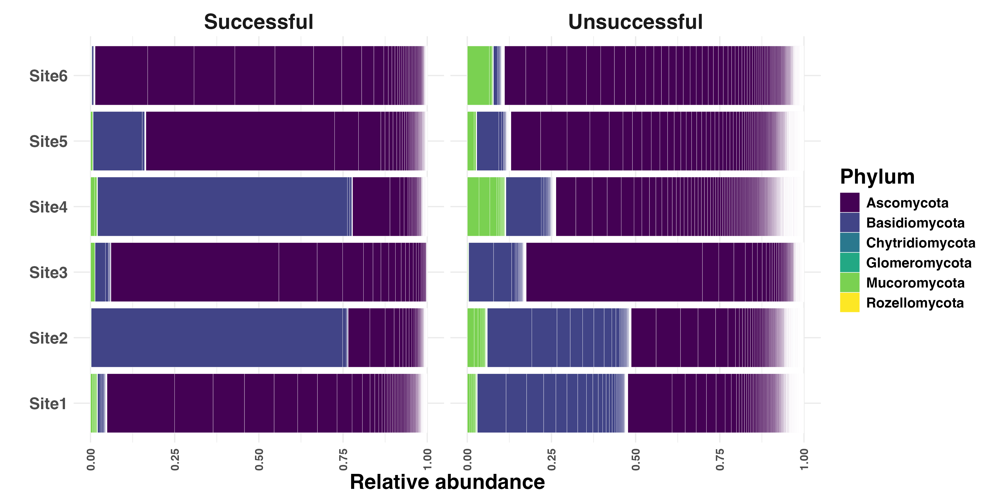

```{r setup, include=FALSE}
knitr::opts_chunk$set(echo = FALSE,warning = FALSE,message = FALSE)
library(tidyverse)
library(knitr)
library(patchwork)
library(kableExtra)
library(phyloseq)
library(zahntools)
# setwd("../R/")
theme_set(theme_bw())
```


**Preliminary data exploration**

**Contaminant ASVs were identified with the prevalence method using the *decontam* package.**

# **Plant measures overview**

**Scaled-centered plant 'health' measures, broken down by treatment factors.**

```{r, fig.width=10, fig.height=6}
p <- readRDS("../Output/figs/Plant_Health_Measures_Plot.RDS")

```


**Model output**


Formula: `value ~ drought * host * fire_freq + (1|inoculum_site/block))`
```{r}

df <- readRDS("../Output/Plant_Health_Measures_Overview_Model_table.RDS")
df %>% 
  mutate(across(where(is.numeric),function(x){round(x,3)})) %>% 
  filter(effect == "fixed") %>% select(-group) %>% 
  kable() %>% 
  kable_classic(lightable_options = 'hover')
```


<br>

___


<br>

# **Inoculum communities overview**

## **Taxonomic overview**

### **Bacteria**

```{r}
site1.inoc.full <- readRDS("../Output/phyloseq_objects/16S_site1.inoc.RDS")
site2.inoc.full <- readRDS("../Output/phyloseq_objects/16S_site2.inoc.RDS")
site3.inoc.full <- readRDS("../Output/phyloseq_objects/16S_site3.inoc.RDS")
site4.inoc.full <- readRDS("../Output/phyloseq_objects/16S_site4.inoc.RDS")
site5.inoc.full <- readRDS("../Output/phyloseq_objects/16S_site5.inoc.RDS")
site6.inoc.full <- readRDS("../Output/phyloseq_objects/16S_site6.inoc.RDS")


site1.inoc.full@phy_tree <- NULL
site2.inoc.full@phy_tree <- NULL
site3.inoc.full@phy_tree <- NULL
site4.inoc.full@phy_tree <- NULL
site5.inoc.full@phy_tree <- NULL
site6.inoc.full@phy_tree <- NULL

bact_inoc <- merge_phyloseq(site1.inoc.full,site2.inoc.full,site3.inoc.full,site4.inoc.full,site5.inoc.full,site6.inoc.full)
bact_inoc <- bact_inoc %>% 
  subset_samples(!is.na("other_frompreviouscolumn"))
bact_inoc %>% 
  subset_taxa(taxa_sums(bact_inoc) > 0) %>% 
  merge_samples("other_frompreviouscolumn") %>% 
  transform_sample_counts(function(x){x/sum(x)}) %>% 
  plot_bar2(fill="Phylum") +
  scale_fill_viridis_d()

```

**Alpha diversity**

Effect of Shannon diversity on plant measures

```{r}
readRDS("../Output/figs/16S_Shannon_vs_plant_site.RDS")
readRDS("../Output/figs/16S_Shannon_vs_plant_burnfreq.RDS")
readRDS("../Output/figs/16S_Shannon_vs_plant_drought.RDS")

readRDS("../Output/16S_alpha_diversity_lmermod_table.RDS") %>% 
  mutate(across(where(is.numeric),function(x){round(x,3)})) %>% 
  kable() %>% kable_classic(lightable_options = 'hover') %>% 
  scroll_box(width = '100%',height = '400px')
```


### **Fungi**

```{r}
site1.inoc.full <- readRDS("../Output/phyloseq_objects/ITS_site1.inoc.RDS")
site2.inoc.full <- readRDS("../Output/phyloseq_objects/ITS_site2.inoc.RDS")
site3.inoc.full <- readRDS("../Output/phyloseq_objects/ITS_site3.inoc.RDS")
site4.inoc.full <- readRDS("../Output/phyloseq_objects/ITS_site4.inoc.RDS")
site5.inoc.full <- readRDS("../Output/phyloseq_objects/ITS_site5.inoc.RDS")
site6.inoc.full <- readRDS("../Output/phyloseq_objects/ITS_site6.inoc.RDS")

bact_inoc <- merge_phyloseq(site1.inoc.full,site2.inoc.full,site3.inoc.full,site4.inoc.full,site5.inoc.full,site6.inoc.full)
bact_inoc <- bact_inoc %>% 
  subset_samples(!is.na("other_frompreviouscolumn"))
bact_inoc %>% 
  subset_taxa(taxa_sums(bact_inoc) > 0) %>% 
  merge_samples("other_frompreviouscolumn") %>% 
  transform_sample_counts(function(x){x/sum(x)}) %>% 
  plot_bar2(fill="Phylum") +
  scale_fill_viridis_d()


```

**Alpha diversity**

Effect of Shannon diversity on plant measures

```{r}
readRDS("../Output/figs/ITS_Shannon_vs_plant_site.RDS")
readRDS("../Output/figs/ITS_Shannon_vs_plant_burnfreq.RDS")
readRDS("../Output/figs/ITS_Shannon_vs_plant_drought.RDS")

readRDS("../Output/ITS_alpha_diversity_lmermod_table.RDS") %>% 
  mutate(across(where(is.numeric),function(x){round(x,3)})) %>% 
  kable() %>% kable_classic(lightable_options = 'hover') %>% 
  scroll_box(width = '100%',height = '400px')
```


## **Comparison between inoculum and root communities**

### **Bacteria**

```{r}
p1 <- readRDS("../Output/figs/16S_inoc_plot_1.RDS") + labs(title = "Inoculum 1")
p2 <- readRDS("../Output/figs/16S_inoc_plot_2.RDS") + labs(title = "Inoculum 2")
p3 <- readRDS("../Output/figs/16S_inoc_plot_3.RDS") + labs(title = "Inoculum 3")
p4 <- readRDS("../Output/figs/16S_inoc_plot_4.RDS") + labs(title = "Inoculum 4")
p5 <- readRDS("../Output/figs/16S_inoc_plot_5.RDS") + labs(title = "Inoculum 5")
p6 <- readRDS("../Output/figs/16S_inoc_plot_6.RDS") + labs(title = "Inoculum 6")

(p1 + p2 + p3) / (p4 + p5 + p6) + patchwork::plot_layout(guides='collect')
```

**Not all taxa in the inoculae were subsequently found in the root samples**

```{r}


```


### **Fungi**

```{r}
p1 <- readRDS("../Output/figs/ITS_inoc_plot_1.RDS") + labs(title = "Inoculum 1")
p2 <- readRDS("../Output/figs/ITS_inoc_plot_2.RDS") + labs(title = "Inoculum 2")
p3 <- readRDS("../Output/figs/ITS_inoc_plot_3.RDS") + labs(title = "Inoculum 3")
p4 <- readRDS("../Output/figs/ITS_inoc_plot_4.RDS") + labs(title = "Inoculum 4")
p5 <- readRDS("../Output/figs/ITS_inoc_plot_5.RDS") + labs(title = "Inoculum 5")
p6 <- readRDS("../Output/figs/ITS_inoc_plot_6.RDS") + labs(title = "Inoculum 6")

(p1 + p2 + p3) / (p4 + p5 + p6) + patchwork::plot_layout(guides='collect')
```

```{r}

```


<br>

___

<br>


<br>

# **Microbial guilds**

## **Bacteria**

I couldn't get a trustworthy annotation of "mutualists" for bacteria, but here are probable pathogens:

```{r mutualistplots16S, fig.width=8,fig.height=5}
p1 <- readRDS("../Output/figs/16S_Pathogen_Plot_grandfir.RDS") + ggtitle("Grand fir")
p2 <- readRDS("../Output/figs/16S_Pathogen_Plot_snowbrush.RDS") + ggtitle("Snowbrush")
p3 <- readRDS("../Output/figs/16S_Pathogen_Plot_grandfir_by_fire.RDS") + ggtitle("Grand fir")
p4 <- readRDS("../Output/figs/16S_Pathogen_Plot_snowbrush_by_fire.RDS") + ggtitle("Snowbrush")
p1
p3
p2
p4
```
  
```{r}
readRDS("../Output/16S_Guild_Model_Output.RDS") %>% 
  # arrange(species) %>% 
  kable %>% 
  kable_classic(lightable_options = 'hover')
```


## **Fungi**

How does the proportion of mutualist fungi relate to indicators of plant health?

In the following figure, the X-axis represents the proportion of fungi that could be identified to a mutualistic guild; the Y-axis represents the value of the various measures of plant success (facets). Y-axis scales vary between facets.

```{r mutualistplots, fig.width=8,fig.height=5}
p1 <- readRDS("../Output/figs/ITS_Mutualist_Plot_grandfir.RDS")
p2 <- readRDS("../Output/figs/ITS_Mutualist_Plot_snowbrush.RDS")
p3 <- readRDS("../Output/figs/ITS_Mutualist_Plot_grandfir_by_fire.RDS")
p4 <- readRDS("../Output/figs/ITS_Mutualist_Plot_snowbrush_by_fire.RDS")
p1 + ggtitle("Grand Fir")
p3 + ggtitle("Snowbrush")
p2 + ggtitle("Grand Fir")
p4 + ggtitle("Snowbrush")

```


**We see an opposite pattern when looking at the proportions of putatively pathogenic fungi**


```{r pathogenplots, fig.width=8,fig.height=5}
p1 <- readRDS("../Output/figs/ITS_Pathogen_Plot_grandfir.RDS")
p2 <- readRDS("../Output/figs/ITS_Pathogen_Plot_snowbrush.RDS")
p3 <- readRDS("../Output/figs/ITS_Pathogen_Plot_grandfir_by_fire.RDS")
p4 <- readRDS("../Output/figs/ITS_Pathogen_Plot_snowbrush_by_fire.RDS")
p1 + ggtitle("Grand Fir") 
p3 + ggtitle("Grand Fir") 
p2 + ggtitle("Snowbrush")
p4 + ggtitle("Snowbrush")

```


```{r}
readRDS("../Output/ITS_Guild_Model_Output.RDS") %>% 
  # arrange(species) %>% 
  kable %>% 
  kable_classic(lightable_options = 'hover')
```


<br>

___

<br>


# **Beta-Diversity**

## **Bacteria**


```{r, fig.width=8,fig.height=6}
readRDS("../Output/figs/16S_Ordination_Plots_Host.RDS") + theme(legend.position = 'bottom')
readRDS("../Output/figs/16S_Ordination_Plots_Host.RDS")
readRDS("../Output/figs/16S_Ordination_Plots_Drought.RDS") + theme(legend.position = 'bottom')
readRDS("../Output/figs/16S_Ordination_Plots_Site.RDS") + theme(legend.position = 'bottom')
readRDS("../Output/figs/16S_Ordination_Plots_Fire.RDS") + theme(legend.position = 'bottom')
cat("PermANOVA run without outlier Sterile-inoculum root samples...")
readRDS("../Output/16S_Permanova_Table.RDS") %>% 
  kable() %>% kable_classic(lightable_options = 'hover')
```


## **Fungi**

```{r, fig.width=8,fig.height=6}
readRDS("../Output/figs/ITS_Ordination_Plots_Host.RDS") + theme(legend.position = 'bottom')
readRDS("../Output/figs/ITS_Ordination_Plots_Drought.RDS") + theme(legend.position = 'bottom')
readRDS("../Output/figs/ITS_Ordination_Plots_Site.RDS") + theme(legend.position = 'bottom')
readRDS("../Output/figs/ITS_Ordination_Plots_Fire.RDS") + theme(legend.position = 'bottom')

cat("PermANOVA run without outlier Sterile-inoculum root samples...")

readRDS("../Output/ITS_Permanova_Table.RDS") %>% 
  kable() %>% kable_classic(lightable_options = 'hover')
```


<br>

___

<br>


# **Important Taxa**

**These taxa were identified by both Random Forest models and _corncob_ as being important predictors of the various experimental conditions & had significant differential abundance between levels of those variables**

## **Bacteria**


### **Differential Abundance**
```{r, fig.width=12,fig.height=6}
readRDS("../Output/figs/16S_DiffAbund_Overview_host.RDS")
readRDS("../Output/figs/16S_DiffAbund_Overview_fire.RDS")
readRDS("../Output/figs/16S_DiffAbund_Overview_drought.RDS")
```

### **Relative Abundances of 'important' taxa in root samples**

```{r, fig.width=12,fig.height=8}
readRDS("../Output/figs/16S_Important_Taxa_Abundances_host.RDS")

readRDS("../Output/figs/16S_Important_Taxa_Abundances_fire.RDS")

readRDS("../Output/figs/16S_Important_Taxa_Abundances_drought.RDS")
```


## **Fungi**


### **Differential Abundance**

```{r,fig.width=12,fig.height=6}
readRDS("../Output/figs/ITS_DiffAbund_Overview_host.RDS")
readRDS("../Output/figs/ITS_DiffAbund_Overview_fire.RDS")

```

**No fungal taxa were found to have significant differential abundance between drought levels**

### **Relative Abundances of 'important' taxa in root samples**

```{r, fig.width=12,fig.height=8}
readRDS("../Output/figs/ITS_Important_Taxa_Abundances_host.RDS")
readRDS("../Output/figs/ITS_Important_Taxa_Abundances_fire.RDS")
readRDS("../Output/figs/ITS_Important_Taxa_Abundances_drought.RDS")


```


<br>

___

<br>


# **Phylogenetic properties**

## **Bacteria**

  - Still kind of messy
  - What specific questions do we need to address with this?
 
## **Fungi**

  - Phylogenetic dispersion is tricky with ITS markers :(
  - Could try GhostTree for fungi of interest that come up as 'unknown'

<br>

_____

<br>


# **Network properties**

## **Selected network attributes**

```{r networkplots1}
readRDS("../Output/figs/Network_Attributes_Plot_by_host-inoc-kingdom.RDS")
```

## **Network properties vs Plant Health**

(Composite scaled-centered plant health measures)

```{r}
net_mod <- readRDS("../Output/Model_Network_Attributes_vs_Plant_Health.RDS")
```


```net_mod$formula```


```{r}
net_mod %>% 
  broom::tidy() %>% 
  kable() %>% 
  kable_classic(lightable_options = 'hover')
```


<br>
_____

<br>


# **Soil chemistry**

**Overview of soil properties for each inoculum source:**


```{r, fig.width=12,fig.height=10}
df <- read_csv("../Data/SoilChem.csv") %>% 
  dplyr::select("Field","NO3","NH4","P","K","SO4-S","B","OM","pH","EC","Zn","Mn","Cu","Fe","Ca","Mg","Na", "TKN","C:N") %>% 
    mutate(inoc_site=Field %>% str_split("-") %>% map_chr(2) %>% str_split("\\.") %>% map_chr(1) %>% 
             str_remove("W") %>% str_replace("Mixed","Sterile") %>% str_replace("Unmixed","Sterile")) %>% 
  dplyr::select(-Field) %>% 
  mutate(across(-inoc_site,SpiecEasi::clr)) %>% 
  pivot_longer(-inoc_site) 

p <-
  df %>% 
  ggplot(aes(x=inoc_site,y=value)) +
  geom_boxplot() +
  facet_wrap(~name,scales = 'free') +
  theme_minimal() +
  theme(axis.text.x = element_text(angle=90,hjust=1),
        strip.text = element_text(face='bold',size=10),
        strip.background = element_rect(fill="#8aab8f",color = 'black',linewidth = .5))
p + labs(caption = "All values are center log-ratio transformed for comparisons")
```


Testing for significant differences between the samples...

Here are the soil properties that differ significantly between inoculum sources. Sterile inoculum soils are set as the intercept. The stats below pretty nicely reflect the obvious patterns in the overall figure.
```{r}
mod <- df %>% 
  mutate(inoc_site=factor(inoc_site,levels=c("Sterile","1","2","3","4","5","6"))) %>% 
  glm(data=.,formula=value~name+ name:inoc_site) 

mod %>% 
  broom::tidy() %>% 
  mutate(term=term %>% str_remove("name")) %>% 
  dplyr::filter(p.value<0.05) %>% 
  mutate(across(where(is.numeric),function(x){round(x,3)})) %>% 
  kableExtra::kable() %>% 
  kableExtra::kable_classic(lightable_options = 'hover') %>% 
  kableExtra::scroll_box(height = '400px',width = '800px')
```


